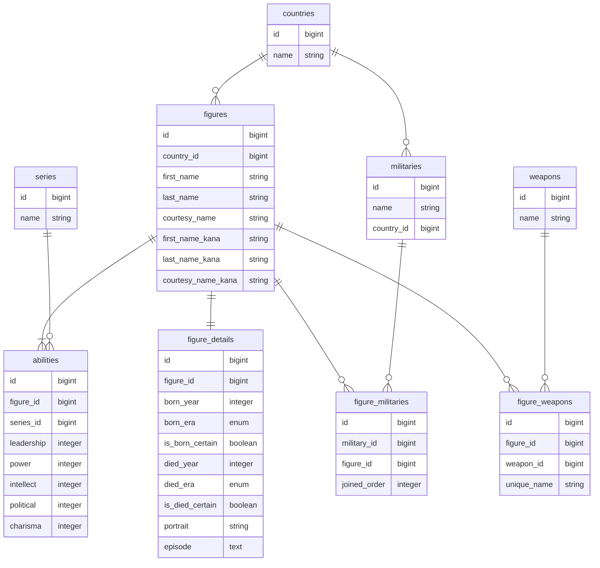

```
npm install
npm run dev
```

```
npm run deploy
```

### ER


```mermaid
erDiagram

figures {
    id bigint
    country_id bigint
    first_name string
    last_name string
    courtesy_name string
    first_name_kana string
    last_name_kana string
    courtesy_name_kana string
}

figure_details {
    id bigint
    figure_id bigint
    born_year integer
    born_era enum
    is_born_certain boolean
    died_year integer
    died_era enum
    is_died_certain boolean
    portrait string
    episode text
}

weapons {
    id bigint
    name string
}

militaries {
    id bigint
    name string
    country_id bigint
}

figure_weapons {
    id bigint
    figure_id bigint
    weapon_id bigint
    unique_name string
}

figure_militaries {
    id bigint
    military_id bigint
    figure_id bigint
    joined_order integer
}

countries {
    id bigint
    name string
}

abilities {
    id bigint
    figure_id bigint
    series_id bigint
    leadership integer
    power integer
    intellect integer
    political integer
    charisma integer
}

series {
    id bigint
    name string
}

figures ||--|{ abilities: ""
figures ||--|| figure_details: ""
countries ||--o{ figures: ""
figures ||--o{ figure_militaries: ""
figures ||--o{ figure_weapons: ""
weapons ||--o{ figure_weapons: ""
militaries ||--o{ figure_militaries: ""
countries ||--o{ militaries: ""
series ||--o{ abilities: ""
```
